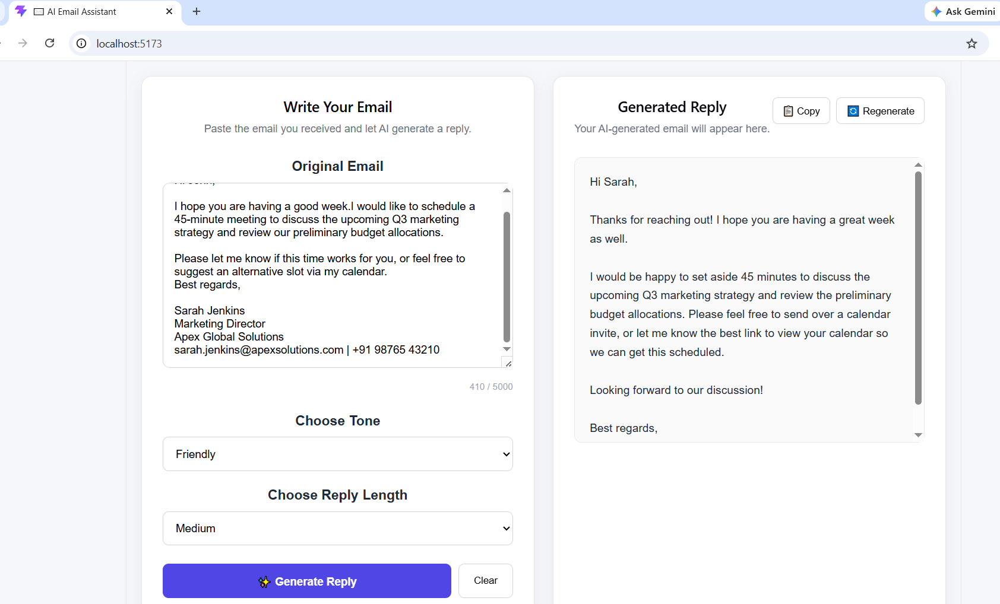

# 🤖 AI-Powered Email Assistant

A full-stack AI-powered application that generates contextual email replies using **Spring Boot, React, and Google Gemini API**.

The user provides an email, selects the desired tone and response length, and the application uses AI to generate an appropriate reply.

✨ Features

- 🤖 AI-generated email replies
- 🎯 Context-aware responses
- 🎨 Multiple email tones
- 📏 Customizable response length
- 🔄 Regenerate replies
- 📋 Copy generated reply to clipboard
- ⏳ Loading state during AI processing
- 🔢 Character limit for input
- ✅ Input validation
- 🌐 React-based web interface
- 🔌 Spring Boot REST API
- 🔐 API key secured using environment variables


🏗️ Architecture

```text
React Frontend
      ↓
Spring Boot REST API
      ↓
Service Layer
      ↓
Prompt Builder
      ↓
Google Gemini API
      ↓
AI Generated Response
      ↓
React Frontend


🛠️ Tech Stack
Backend
Java
Spring Boot
REST APIs
WebClient
Jackson JSON
Maven
Frontend
React
JavaScript
HTML
CSS
Vite
AI
Google Gemini API
Prompt Engineering


🔄 How It Works
User enters the email they received.
User selects the desired tone and response length.
React sends the request to the Spring Boot backend.
Spring Boot builds the AI prompt.
The backend sends the prompt to Google Gemini using WebClient.
Gemini generates the email reply.
Spring Boot extracts the generated response.
The response is returned to React.
React displays the generated reply.


🔌 API
Generate Email Reply

POST

/api/email/generate
Request
{
  "emailcontent": "Could you please confirm if you are available for a meeting tomorrow at 3 PM?",
  "tone": "friendly"
}


📂 Project Structure
ai-email-assistant/
│
├── src/
│   └── main/
│       ├── java/
│       │   └── com/email/email_writer/
│       │       ├── Controller/
│       │       ├── DTO/
│       │       └── Service/
│       │
│       └── resources/
│           └── application.properties
│
├── email-writer-frontend/
│   ├── src/
│   ├── public/
│   ├── package.json
│   └── vite.config.js
│
├── pom.xml
├── .gitignore
├── mvnw
└── mvnw.cmd


⚙️ Setup & Run
Prerequisites
Java 21+
Maven
Node.js
npm
Google Gemini API key


1. Clone the repository
git clone https://github.com/Himanshu2334/ai-email-assistant.git
cd ai-email-assistant


2. Configure Gemini API Key

Set the following environment variable on your system:

GEMINI_API_KEY=your_api_key

The application reads the key using:

gemini.api.key=${GEMINI_API_KEY}

Never commit your API key to source control.

3. Start Backend

From the project root:

mvn spring-boot:run

Backend: http://localhost:8080


4. Start Frontend

Open another terminal:

cd email-writer-frontend
npm install
npm run dev

Frontend: http://localhost:5173


## 📸 Screenshots

### AI Email Assistant



🚀 Future Improvements
Spring Security + JWT authentication
PostgreSQL persistence
Email history
Gmail integration
Streaming AI responses
Multiple AI model support
Unit and integration testing
Docker deployment
👨‍💻 Author

Himanshu

GitHub: https://github.com/Himanshu2334


